<!--
  ==========================================================
  GitHub Profile README - mizzzk-dev
  作品ページのような見た目と、実際の開発レンジが伝わる情報設計を両立する
  ==========================================================
-->

  

  <strong>mizzz</strong> 
  Frontend-focused Full Stack Developer / Product Builder

  UI起点でプロダクトを形にする、フロントエンド寄りのフルスタック開発者。 
  Webアプリ、ダッシュボード、Bot、基盤まで、使う体験から逆算して設計・実装しています。

  

## About

見た目の気持ちよさと、運用で壊れにくい設計を同時に成立させるのが好きです。
React / Next.js を軸に、必要に応じて API・DB・Worker・Discord Bot まで接続し、UIから土台まで一気通貫で組み立てます。
個人開発を継続しながら、**「今あるプロダクトを一段使いやすくする改善」**にも丁寧に向き合っています。

  

## Featured Builds

### [lunaria](https://github.com/mizzzk-dev/lunaria) — Community Operating Platform
Discordコミュニティ運営を支える中核プロダクト。
Bot・管理ダッシュボード・API・Worker を分離しつつ統合運用し、**ルール運用と日々のオペレーションをプロダクトとして回す**ための基盤。

### [quizverse](https://github.com/mizzzk-dev/quizverse) — Interactive Learning / Quiz Experience
クイズ体験を通じた学習・参加導線を設計する Web プロダクト。
問題体験だけでなく、継続利用しやすい情報設計・画面遷移・拡張性を重視。

### [project-asterveil](https://github.com/mizzzk-dev/project-asterveil) — Worldbuilding-driven Product Concept
世界観先行で機能を束ねる、コンセプト設計寄りの開発ライン。
UIトーン、命名、機能群の整合を取りながら、プロダクトの「意味」を設計する実験領域。

### [ChoiceBoard](https://github.com/mizzzk-dev/ChoiceBoard) — Decision Support Dashboard
選択肢の比較や意思決定を助ける、軽量ダッシュボード系プロダクト。
一覧性・操作レスポンス・情報圧縮を重視し、日常で使える意思決定UIを目指した実装。

### [vaultsend](https://github.com/mizzzk-dev/vaultsend) — Secure Transfer Backend Foundation
Go / PostgreSQL を中心にしたバックエンド基盤ライン。
フロントの表層だけでなく、データ設計・API責務・運用前提まで含めて作る姿勢を示すリポジトリ。

  

## Stack / Engineering Lanes

  

- **Frontend Core**: React / Next.js / TypeScript / Tailwind
- **Product Runtime**: Node.js / API / Worker / Discord Bot
- **Backend Base**: Go / PostgreSQL / Docker
- **Product Design**: UI構成、導線設計、改善サイクル

  

## Work With Me

対応しやすい領域:

- LP / コーポレートサイト
- WebアプリUI実装
- ダッシュボード
- Discord Bot
- 小規模な改善

「全部作り直す」より、**今あるものを活かしながら改善する相談**も歓迎です。
駆け出しの立場だからこそ、要件を丁寧にすり合わせて着実に進めます。

  

## Signal

  
  

  

  Stats / Trophy は主役ではなく、日々の継続を補助的に示すセクションとして配置しています。

  

## Freelance Note

フリーランス色を強く出すというより、
**「小さく始めて、確実に良くする」**実装パートナーとして相談しやすい距離感を大事にしています。
UI改善・機能追加・設計整理のどこからでも、状況に合わせて伴走します。

  

## Links / Contact

- GitHub: https://github.com/mizzzk-dev
- Website: https://mizzz.jp
- X: https://x.com/mizzzjp
- Zenn: https://zenn.dev/mizzz
- Qiita: https://qiita.com/mizzz-dev
- Email: contact@mizzz.jp
