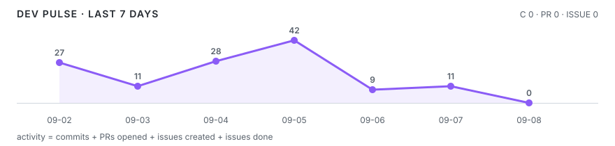

<strong>日本語</strong> · <a href="./README.en.md">English</a>

  

<h1 align="center">いゔる。 a.k.a. mizzz（ずーみー）</h1>

  <strong>プロダクト志向のフルスタックエンジニア</strong> 
  React / TypeScript を軸に、Web・Discord・Realtime AI・API・DB・運用までつなげて実装しています。

  
  
  

小さく作る · 速く磨く · 安全に運用する

---

<!-- PROFILE-SIGNAL:LIVE-SIGNAL:START -->
## LIVE SIGNAL // Development status

<table width="100%">
  <tr>
    <td width="33%" align="center"><strong>● BUILDING</strong> last public activity · 09/07 23:40 JST</td>
    <td width="34%" align="center"><strong>🌤️ ACTIVE</strong> 11 public actions today</td>
    <td width="33%" align="center"><strong>🔥 14 DAY STREAK</strong> public GitHub activity</td>
  </tr>
</table>
<!-- PROFILE-SIGNAL:LIVE-SIGNAL:END -->

<!-- DAILY-ACTIVITY:START -->
## TODAY // Activity overview

2026-09-07 JST · public GitHub activity

<table width="100%">
  <tr>
    <td width="25%" align="center"><strong>8</strong> COMMITS</td>
    <td width="25%" align="center"><strong>2</strong> PRS OPENED</td>
    <td width="25%" align="center"><strong>1</strong> ISSUES CREATED</td>
    <td width="25%" align="center"><strong>0</strong> ISSUES DONE</td>
  </tr>
</table>
<!-- DAILY-ACTIVITY:END -->

<!-- PROFILE-SIGNAL:FOCUS:START -->
## CURRENT FOCUS // What is moving now

<table width="100%">
  <tr>
    <td width="62%" valign="top"><strong><a href="https://github.com/ivRooom/ivrm-dashboard">ivRooom/ivrm-dashboard</a></strong> weighted activity 48% · score 12 · 9 events</td>
    <td width="38%" valign="top"><strong>CURRENT STACK</strong> <code>TypeScript</code> <code>PLpgSQL</code> <code>CSS</code> <code>Python</code></td>
  </tr>
</table>
<!-- PROFILE-SIGNAL:FOCUS:END -->

<!-- PROFILE-SIGNAL:PULSE:START -->
## DEV PULSE // Last 7 days

  

### QUALITY SIGNAL // Last 7 days

<table width="100%">
  <tr>
    <td width="25%" align="center"><strong>ATTENTION</strong> CI SIGNAL</td>
    <td width="25%" align="center"><strong>83%</strong> PASS RATE</td>
    <td width="25%" align="center"><strong>25 / 30</strong> PASSED / EVALUATED</td>
    <td width="25%" align="center"><strong>3</strong> REPOS WITH CI</td>
  </tr>
</table>
<!-- PROFILE-SIGNAL:PULSE:END -->

<!-- PROFILE-SIGNAL:NOW-BUILDING:START -->
## NOW BUILDING // Active repositories

<table width="100%"><tr><td width="33%" valign="top"><strong>01 · <a href="https://github.com/ivRooom/ivrm-dashboard">ivRooom/ivrm-dashboard</a></strong> 46% weighted · HEALTHY · CI pass rate 90% last activity · 09/07 19:51 JST</td><td width="33%" valign="top"><strong>02 · <a href="https://github.com/ivRooom/Herta">ivRooom/Herta</a></strong> 8% weighted · ATTENTION · CI pass rate 60% last activity · 09/07 12:55 JST</td><td width="33%" valign="top">—</td></tr></table>
<!-- PROFILE-SIGNAL:NOW-BUILDING:END -->

<!-- PROFILE-SIGNAL:ACTIVITY-STREAM:START -->
## ACTIVITY STREAM // Latest public signals

<table width="100%">
  <tbody>
    <tr><td width="10%"><code>09/07 19:49</code></td><td width="14%"><code>PR</code></td><td><strong><a href="https://github.com/ivRooom/ivrm-dashboard">ivRooom/ivrm-dashboard</a></strong> — <a href="https://github.com/ivRooom/ivrm-dashboard">PR #119をマージ</a></td></tr>
    <tr><td width="10%"><code>09/07 19:46</code></td><td width="14%"><code>PR</code></td><td><strong><a href="https://github.com/ivRooom/ivrm-dashboard">ivRooom/ivrm-dashboard</a></strong> — <a href="https://github.com/ivRooom/ivrm-dashboard">PR #119を作成</a></td></tr>
    <tr><td width="10%"><code>09/07 19:45</code></td><td width="14%"><code>PUSH</code></td><td><strong><a href="https://github.com/ivRooom/ivrm-dashboard">ivRooom/ivrm-dashboard</a></strong> — <a href="https://github.com/ivRooom/ivrm-dashboard/commits">fix/issue-117-restore-test-sla-read-modelへ1コミットをPush</a></td></tr>
    <tr><td width="10%"><code>09/07 19:45</code></td><td width="14%"><code>CREATE</code></td><td><strong><a href="https://github.com/ivRooom/ivrm-dashboard">ivRooom/ivrm-dashboard</a></strong> — <a href="https://github.com/ivRooom/ivrm-dashboard">Created branch fix/issue-117-restore-test-sla-read-model</a></td></tr>
  </tbody>
</table>
<!-- PROFILE-SIGNAL:ACTIVITY-STREAM:END -->

---

<!-- DEVELOPER-ANALYTICS:START -->
## ENGINEERING PROFILE

### CORE TECHNOLOGIES

  
  
  
  
  
  
  
  

### ENGINEERING RANGE

`Full Stack` `Frontend` `Backend / API` `Realtime AI` `Desktop App` `Developer Platform` `Observability` `Infrastructure`

### HOW I BUILD

`Repository中心の開発` `Security by Design` `自動テスト` `Accessibility` `Observability` `Least Privilege` `Fail-close` `Release Automation`

### ASSIGNMENT FIT

| Area | Public evidence coverage |
| --- | ---: |
| Discord / Community Systems | 100% |
| Full-stack Product Development | 100% |
| Platform / Developer Tooling | 100% |
| Realtime AI / Voice | 100% |
| DevOps / Observability | 86% |

<a href="./SKILL_SHEET.md">Skill Sheet</a> · <a href="./reports/developer-analytics.md">Developer Analytics</a> · <a href="./SKILL_SHEET.en.md">English</a>

<!-- DEVELOPER-ANALYTICS:END -->

---

<!-- ENGINEERING-DNA:START -->
## ENGINEERING DNA // Public evidence profile

公開Repository / Engineering Practice / Assignment Evidenceから自動生成。詳細は <a href="./reports/developer-analytics.md">Developer Analytics</a>。

<!-- ENGINEERING-DNA:END -->

---

## PUBLIC BUILDS

<table>
  <tr>
    <td width="50%" valign="top">
      <h3><a href="https://github.com/ivRooom/Herta">Herta</a></h3>
      
<strong>Discord Community Platform</strong>

      
NestJS API、Next.js Studio、Discord Bot、BullMQ Worker、Plugin Runtime、PostgreSQL / Redisを含むモノレポ。

      
<code>TypeScript</code> <code>NestJS</code> <code>Next.js</code> <code>PostgreSQL</code> <code>Redis</code>

    </td>
    <td width="50%" valign="top">
      <h3><a href="https://github.com/mizzz-ivr/roomate-voice">RooMate Voice</a></h3>
      
<strong>Discord × Realtime Voice AI / Windows Desktop</strong>

      
Realtime Voice AI、Discord Voice、割り込み、Secret保護、Electron Desktop、Installer / Releaseまで扱うOSS。

      
<code>TypeScript</code> <code>OpenAI Realtime</code> <code>Discord Voice</code> <code>Electron</code> <code>Docker</code>

    </td>
  </tr>
  <tr>
    <td width="50%" valign="top">
      <h3><a href="https://github.com/mizzz-ivr/ivmz-home">ivmz-home</a></h3>
      
<strong>Personal Web / Portfolio Platform</strong>

      
Next.js / Payload / PostgreSQLを軸に、CMS、SEO、Accessibility、Testing、運用可搬性まで含めるWeb Platform。

      
<code>Next.js</code> <code>React</code> <code>Payload</code> <code>PostgreSQL</code> <code>Playwright</code>

    </td>
    <td width="50%" valign="top">
      <h3><a href="https://github.com/ivRooom/ivrm-dashboard">IVRM Dashboard</a></h3>
      
<strong>Operations / Observability Platform</strong>

      
Next.js + Supabase + Go AgentでMinecraft / Web / Cloud基盤を安全に監視する統合運用コンソール。

      
<code>TypeScript</code> <code>Next.js</code> <code>Go</code> <code>Supabase</code> <code>Docker</code>

    </td>
  </tr>
</table>

---

<!-- PROFILE-SIGNAL:RECAP:START -->
## DEV RECAP // Tracked history

<table width="100%">
  <tr>
    <td width="25%" align="center"><strong>🔥 14</strong> DAY STREAK</td>
    <td width="25%" align="center"><strong>8</strong> COMMITS · THIS WEEK</td>
    <td width="25%" align="center"><strong>2</strong> PRS · THIS WEEK</td>
    <td width="25%" align="center"><strong>0</strong> ISSUES DONE · THIS WEEK</td>
  </tr>
</table>

<strong>MONTHLY SUMMARY</strong>

 
<table width="100%"><tr><td width="25%" align="center"><strong>92</strong> COMMITS</td><td width="25%" align="center"><strong>29</strong> PRS</td><td width="25%" align="center"><strong>6</strong> ISSUES DONE</td><td width="25%" align="center"><strong>143</strong> ACTIVITY</td></tr></table>

<strong>YEARLY SUMMARY // 2026</strong>

 
<table width="100%"><tr><td width="20%" align="center"><strong>14</strong> ACTIVE DAYS</td><td width="20%" align="center"><strong>1680</strong> COMMITS</td><td width="20%" align="center"><strong>194</strong> PRS</td><td width="20%" align="center"><strong>65</strong> ISSUES DONE</td><td width="20%" align="center"><strong>2040</strong> ACTIVITY</td></tr></table>

14 tracked days in 2026.

<strong>LIFETIME SUMMARY // Tracked history</strong>

 
<table width="100%"><tr><td width="20%" align="center"><strong>14</strong> ACTIVE DAYS</td><td width="20%" align="center"><strong>1680</strong> COMMITS</td><td width="20%" align="center"><strong>194</strong> PRS</td><td width="20%" align="center"><strong>65</strong> ISSUES DONE</td><td width="20%" align="center"><strong>2040</strong> ACTIVITY</td></tr></table>

Profile Signal tracked lifetime · tracked since 2026-08-25 · 14 tracked days. GitHub account lifetime totalsではありません。

<!-- PROFILE-SIGNAL:RECAP:END -->

---

## LINKS

  
  
  
  
  
  

  
  
  
  
  
  

